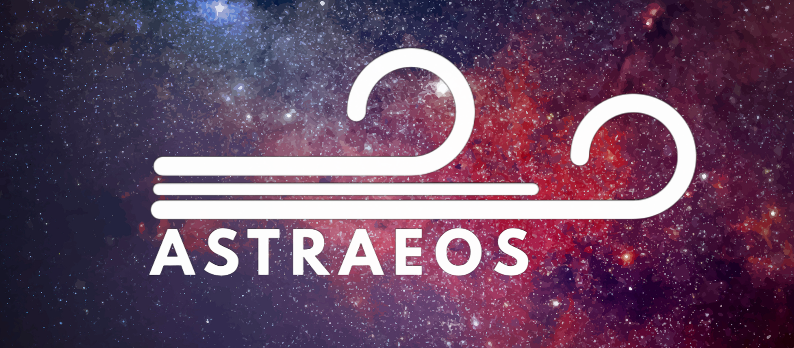

  

# 🌌 ASTRAEOS

*O **Astraeos** (ou Atraeu) é um titã grego da astronomia e do crepúsculo, pai das estrelas, dos planetas e dos quatro ventos cardeais: Bóreas, Zéfiro, Noto e Euro.*

 

## 🏛️ Informações Acadêmicas
> **Instituição:** Instituto de Astronomia, Geofísica e Ciências Atmosféricas (IAG) — Universidade de São Paulo (USP)  
> **Desenvolvedor:** Victor Moreira Acacio   
> **Orientação:** Profa. Dra. Vera Jatenco Silva Pereira   
> **Projeto:** Trabalho de Graduação (TG) — Bacharelado em Astronomia  
> **Data:** 2026

---

## 🔭 Sobre o ASTRAEOS

O **ASTRAEOS** foi criado para estudar a física entre a astrofísica estelar teórica e a análise de ambientes exoplanetários. Utilizando uma arquitetura híbrida (Python e C), o software permite calcular perfis de vento estelar através de modelos distintos como por amortecimento de ondas de Alfvén (Jatenco-Pereira & Opher, 1989) ou o clássico vento térmico de Parker.

Além do estudo do plasma estelar, o ASTRAEOS projeta estes ventos na distância orbital de exoplanetas, calculando a **pressão dinâmica**, os **limites da magnetopausa** e o impacto severo de **Ejeções de Massa Coronal (CMEs)**. Também é dotado de um mapeamento das Zonas Habitáveis clássicas e de Kopparapu et al. (2013).

---

## ✨ Principais Funcionalidades

- 🚀 **Motor Numérico em C:** Algoritmo de busca topológica com integração Runge-Kutta (RK4) escrito em C para máxima performance, lidando dinamicamente com as singularidades através das regras de L'Hôpital.
- 🌊 **Modelagem de Ventos:** Atualmente conta com suporte a modelo JPO de amortecimento de onda (Constante e Ressonante) e modelo de vento térmico puro (Parker).
- 🪐 **Mapa de Habitabilidade:** Visualização polar das fronteiras da Zona Habitável (Recent Venus, Runaway/Moist/Maximum Greenhouse, Early Mars).
- 🛡️ **Escudo Magnetosférico:** Simulação vetorial 2D da magnetosfera do exoplaneta com campo magnético comprimido sob fluxo de plasma quiescente e durante impactos de CME.
- 📊 **Open Science:** Exportação limpa de matrizes `.npz` e `.csv` contendo todas as variáveis físicas e resultados obtidos para reprodutibilidade e plotagem independente.

---

## 📸 Interface e Visualizações

  
  
<i>Interface do ASTRAEOS. Contém uma região de exibição de gráficos, configurações de parâmetros de ventos estelares, configurações de parâmetros de simulação de exoplanetas e exibição de feedbacks do software.</i>

 

  
  
<i>Simulação 2D vetorial do impacto do plasma na magnetosfera planetária. Curva azul e vermelha representam a magnetosfera do vento quiescente e atingido por CME, respectivamente. Círculo verde e vermelho pontilhados representam limites empíricos terrestres de raio de magnetopausa para os dias atuais e para o periodo paleoarqueano, respectivamente.</i>

 

  
  
<i>Mapa de Zona Habitável com gradiente de densidade normalizada do vento simulado. Círulo vermelho pequeno representa o planeta inserido.</i>

 

  
  
<i>Distribuição de propriedades do plasma normalizadas. Contém curvas de comprimento de amortecimento, velocidade, densidade, fluxo de ondas Alfvén, amplitude e pressão dinâmica do vento.</i>

 

  
  
<i>Perfil de velocidade do vento estelar contendo planetas simulados e zona habitável. Ponto crítico apresentado como ponto avermelhado sobre a curva.</i>

---

## ⚙️ Instalação e Requisitos

### Pré-requisitos
O seu simulador já vem empacotado e pronto para uso! Tudo o que você precisa é:
- **Sistema Operacional:** Windows 10 ou superior

### Como rodar
1. Baixe o arquivo `.zip` ou o instalador mais recente na aba [Releases](#).
2. Extraia o conteúdo para uma pasta de sua preferência.
3. Dê dois cliques no executável `ASTRAEOS.exe` para iniciar.

---

## 📄 Licença
Este projeto está licenciado sob a *Licença MIT*. O uso acadêmico, modificação e distribuição são encorajados.

---

## 🙏 Agradecimentos

Gostaria de expressar minha profunda gratidão à **Profa. Dra. Vera Jatenco Silva Pereira** pela orientação acadêmica. À **Yasmmin Ferreira Tamburus** pelo auxílio no desenvolvimento do código. Agradecimentos estendidos ao **Instituto de Astronomia, Geofísica e Ciências Atmosféricas da USP** por fornecer o ambiente intelectual para o desenvolvimento desta pesquisa.

---
